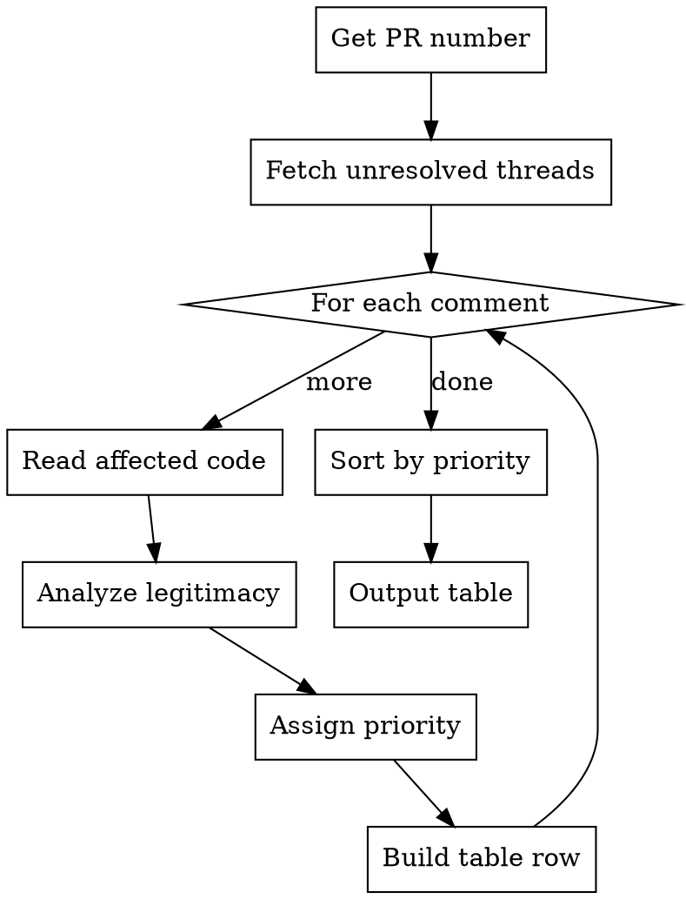

# Analyze PR Comments

Fetches unresolved PR review comments and analyzes each for legitimacy, priority, and impact.

## When to Use

- User asks to review/analyze PR comments
- User wants to understand which review feedback to prioritize
- User asks "what PR comments should I address first?"
- User wants to check if reviewer feedback is valid

## Workflow



## Step 1: Get PR Number

If not provided, detect from current branch:
```bash
gh pr view --json number -q '.number'
```

Or user provides PR number/URL directly.

## Step 2: Fetch Unresolved Review Threads

```bash
gh api graphql -f query='
query($owner: String!, $repo: String!, $pr: Int!) {
  repository(owner: $owner, name: $repo) {
    pullRequest(number: $pr) {
      title
      url
      reviewThreads(first: 100) {
        nodes {
          isResolved
          isOutdated
          path
          line
          startLine
          comments(first: 10) {
            nodes {
              body
              author { login }
              createdAt
            }
          }
        }
      }
    }
  }
}' -f owner={owner} -f repo={repo} -F pr={number}
```

Get owner/repo from:
```bash
gh repo view --json owner,name -q '.owner.login + "/" + .name'
```

Filter to `isResolved: false` threads only.

## Step 3: Analyze Each Comment

For each unresolved thread:

1. **Read the affected code** using the `path` and `line` fields
2. **Understand the reviewer's concern** from comment body
3. **Determine legitimacy:**
   - **Legit**: Valid concern, should be addressed
   - **Partially Legit**: Has merit but overstated or edge case
   - **Not Legit**: Reviewer misunderstood or incorrect
4. **Assign priority** (P0-P3):
   - **P0 Critical**: Security, data loss, crashes
   - **P1 High**: Bugs, incorrect behavior, performance issues
   - **P2 Medium**: Code quality, maintainability, minor issues
   - **P3 Low**: Style, preferences, nitpicks

## Step 4: Output Analysis Table

Sort by priority (P0 first), then by legitimacy (Legit first).

**Format:**

| #   | Priority | Legit?  | Summary                        | File:Line         | Impact                 | Recommendation                          |
| --- | -------- | ------- | ------------------------------ | ----------------- | ---------------------- | --------------------------------------- |
| 1   | P0       | Yes     | Missing auth check on endpoint | api/users.ts:45   | Security vulnerability | Add auth middleware                     |
| 2   | P1       | Partial | Race condition possible        | lib/sync.ts:120   | Edge case bug          | Add mutex if high traffic               |
| 3   | P2       | Yes     | Magic number should be const   | utils/calc.ts:33  | Maintainability        | Extract to named constant               |
| 4   | P3       | No      | Prefers different naming       | models/user.ts:12 | Style only             | Keep current (consistent with codebase) |

## Analysis Guidelines

### Legitimacy Assessment

**Legit indicators:**
- Points to actual bug or incorrect behavior
- Security concern with real attack vector
- Performance issue with measurable impact
- Violates documented project conventions

**Not Legit indicators:**
- Reviewer unfamiliar with codebase patterns
- Suggestion contradicts project conventions
- Hypothetical concern with no realistic scenario
- Personal preference presented as requirement

### Priority Assignment

**P0 - Critical (address immediately):**
- Security vulnerabilities (auth bypass, injection, data exposure)
- Data loss or corruption scenarios
- Application crashes or hangs
- Breaking changes to public APIs

**P1 - High (address before merge):**
- Functional bugs
- Performance regressions
- Missing error handling for likely scenarios
- Logic errors

**P2 - Medium (should address):**
- Code quality improvements
- Missing tests for new code
- Documentation gaps
- Minor performance optimizations

**P3 - Low (nice to have):**
- Style/formatting preferences
- Alternative approaches (equally valid)
- Speculative improvements
- Nitpicks

## Example Output

**PR #123: Add user authentication** - 5 unresolved comments

| #   | Priority | Legit?  | Summary                     | File:Line           | Impact                 | Recommendation                          |
| --- | -------- | ------- | --------------------------- | ------------------- | ---------------------- | --------------------------------------- |
| 1   | P0       | Yes     | JWT secret hardcoded        | auth/jwt.ts:15      | Critical security flaw | Move to env variable                    |
| 2   | P1       | Yes     | Missing password validation | auth/register.ts:42 | Allows weak passwords  | Add zod schema validation               |
| 3   | P2       | Partial | Consider rate limiting      | auth/login.ts:28    | Brute force possible   | Add if public-facing, skip for internal |
| 4   | P3       | No      | Rename `usr` to `user`      | auth/session.ts:8   | Style preference       | Keep - matches existing patterns        |

---

**Summary:**
- 2 comments require immediate action (P0-P1)
- 1 comment worth addressing (P2)
- 1 comment can be dismissed with explanation (P3)
